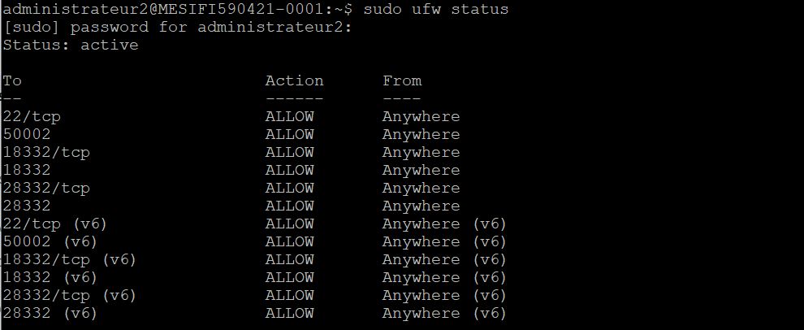
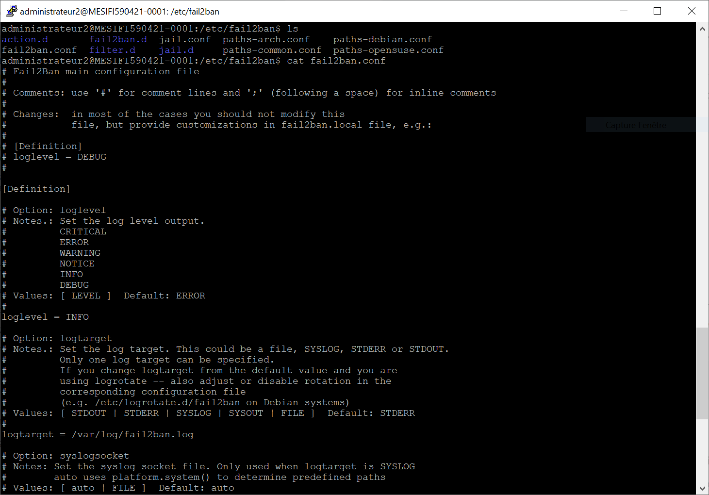
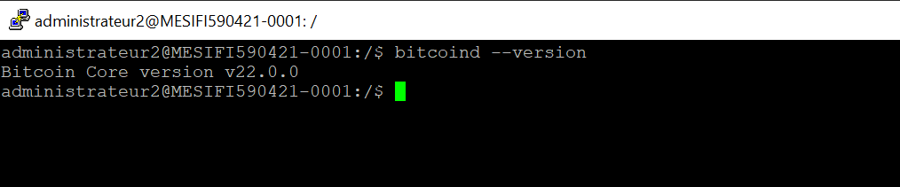
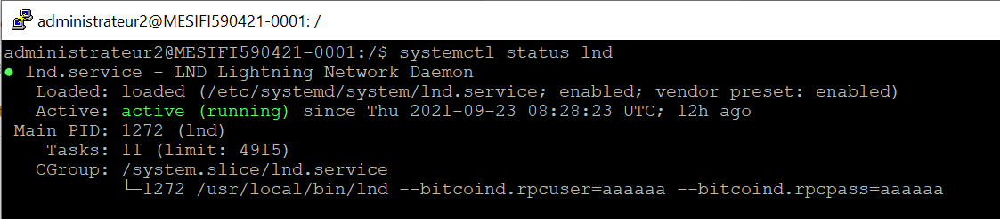

# TD1 Monnaie Numérique

TD1 de monnaie numérique réalisé par Lucas LEVY et Quentin GIBON
 

### Setting up SSH properly (2pts) ✔️
Connection au serveur avec la clé privée :

 

### Setting up UFW and Fail2Ban (2pts) ✔️
UFW :

Fail2ban :

 

### Installing Bitcoind (2pts) ✔️
Bitcoind est bien installé (il faut bien prendre la version amd64 et non la arm):

 

### Turning BitcoinD into a service (2 pts) ✔️
Bitcoind deamon fonctionne bien cependant pour faire tourner le noeud sur le testnet il faut rajouter le flag `--testnet` et pour pouvoir utiliser lnd il faut rajouter le `rpcuser`, `rpcpassword`, `zmqpubrawblock`, `zmqpubrawtx` en flag également car s'ils sont dans le ficher `.conf` ils ne sont pas détectés:

 

### Creating a wallet and depositing tBTC in it (2 pts) ✔️
Par simplicité nous avons créé l'alias suivant dans le fichier `.bashrc`: `alias lncli='lncli --network=testnet'`
Après avoir unlock le wallet on peut dériver une adresse de la seed grâce à la commande `lncli newaddress p2wkh` et demander des tBTC sur un faucet.
 

### Installing LND (2 pts) ✔️
lnd est installé :

 

### Turning LND into a service (2 pts) ✔️
lnd est effectivement actif :

 

### Opening a lightning channel (2 pts) ✔️
Il faut trouver un noeud avec lequel il est possible d'ouvrir un channel, exécuter le commande `lnd connect pk@ip` puis ouvrir le channel en ayant assez de tBTC
 

### Setting up Tor (2pts) ✔️
Tor est configuré :

 

### Running your own BTC explorer (2 pts)
