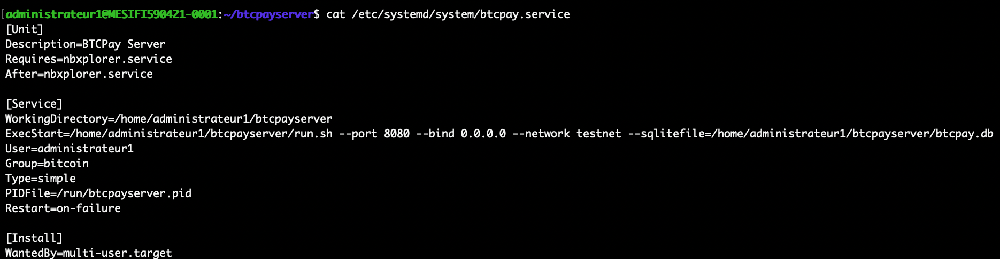
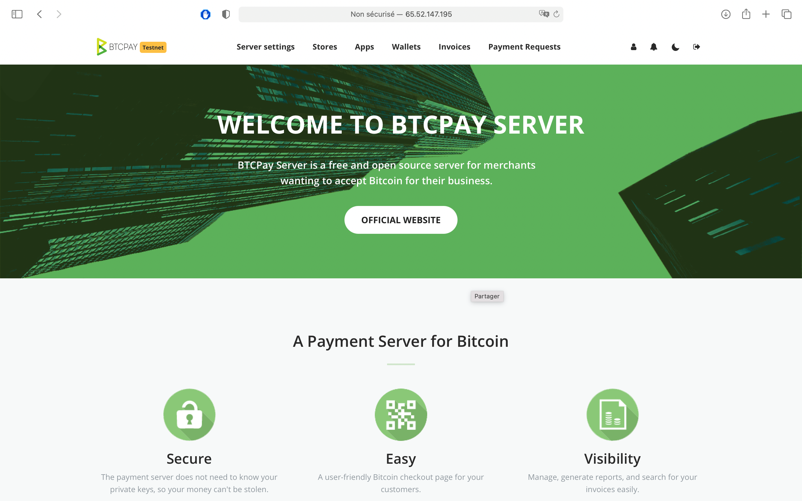
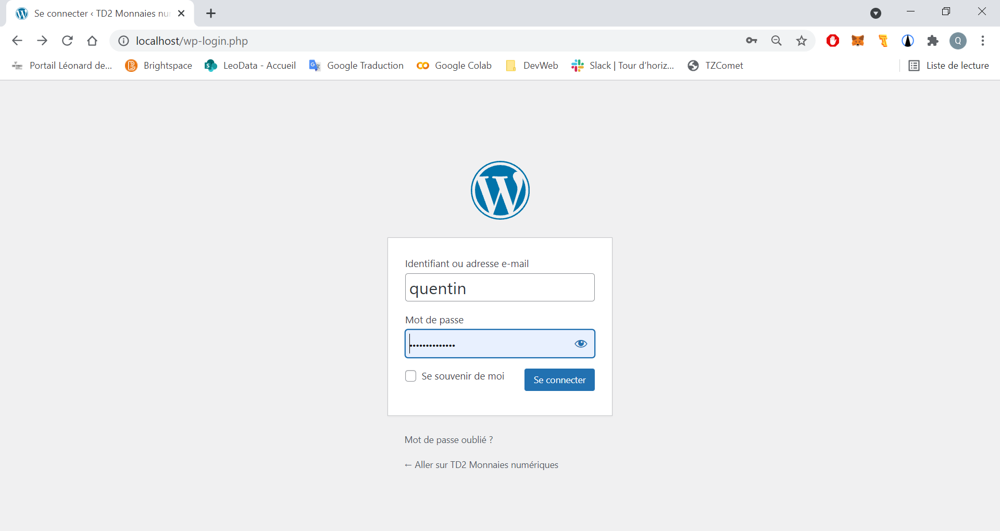
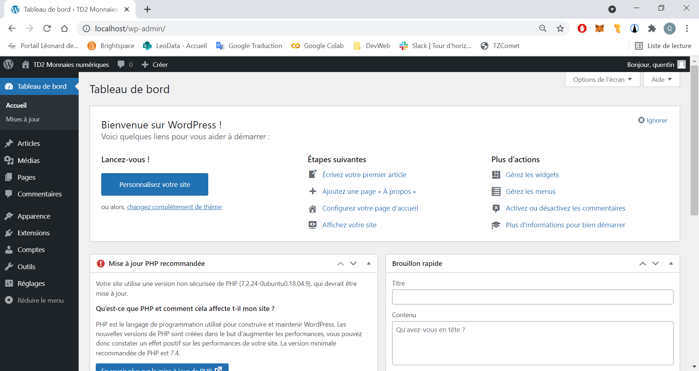
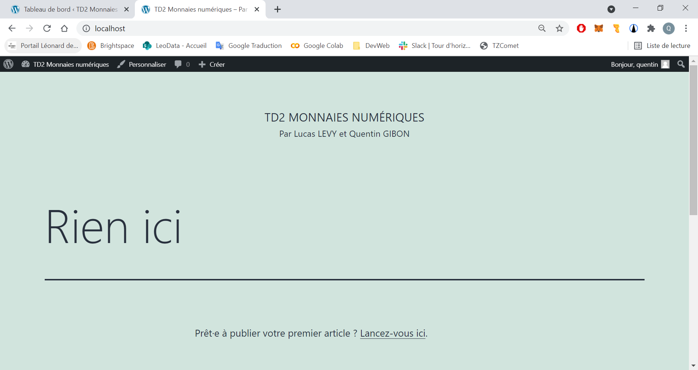
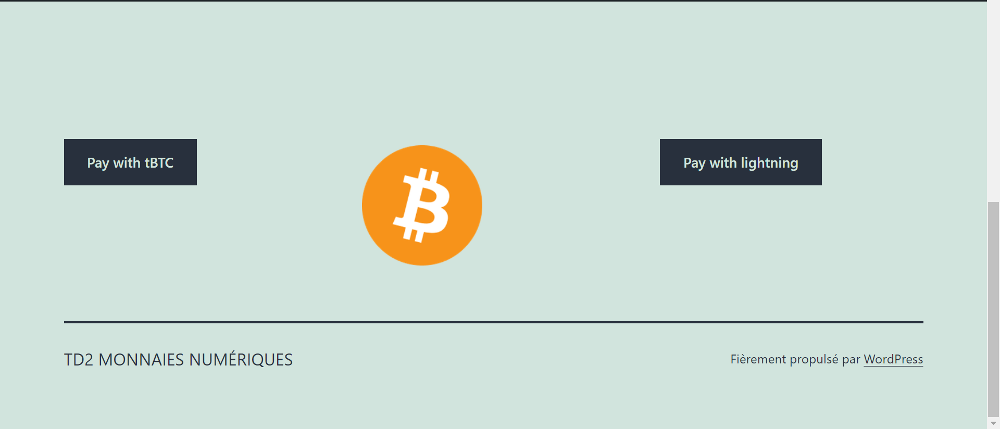

# TD2 Monnaie Numérique

TD2 de monnaie numérique réalisé par Lucas LEVY et Quentin GIBON
 

### Install dependencies (2 pts) ✔️
 

### Adapt UFW config (2pts) ✔️
UFW :

 

### Adapt SSH config (2pts) ✔️
Les clés SSH sont bien configurées :

 

### Install BTC Pay server (4 pts) ✔️
BTC Pay server est bien installé :

 

### Configure your BTC Pay server (2 pts) ✔️
Le server est bien configuré et se lance :

 

### Install website / Wordpress (4 pts) ✔️
Wordpress s'est bien installé, on peut se connecter au dashboard :

On a ainsi le site :

 

### Create a button to pay with tBTC (2 pts) & Create a button to pay with lightning (2 pts) ✔️
Les deux boutons sont créés sur le site wordpress :

 