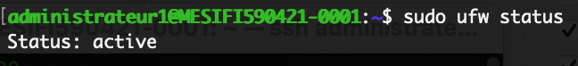

# TD3 Monnaie Numérique

TD3 de monnaie numérique réalisé par Lucas LEVY et Quentin GIBON
<br>

## Cleaning up setup (2 pts) ✔️
<br>

## Adapt UFW settings (2pts) ✔️
UFW :

<br>

## Installing dependencies (2 pts) ✔️
<br>

## Installing Geth (2 pts) ✔️
Geth est installé, exemple :

<br>

## Running Geth on the rinkeby network (2 pts) ✔️

On utilise bien le flag `--rinkeby` pour utiliser geth sur rinkeby: 


## Turning Geth into a service (2 pts) ✔️
Le fichier de service est le suivant:


## Open the RPC API to interact with your node (2 pts) ✔️
On utilise le flag `--http` pour pouvoir utiliser les API


## Connect to the Geth console and extract last block number (2 pts) ✔️
On affiche le numéro du dernier block :

<br>

## Connect to the Geth console and show events data from a specific transaction (2 pts) ✔️
On affiche les données de la transaction `0x7c2ea0a953a1187fc30d4ce1721ad6938da5ebaf10546045bf5118e6f45eabeb` (sur Rinkeby) :


<br>

## Configure truffle to deploy a smart contract through your node (2 pts) ✔️
On crée d'abord un tunnel ssh:

Ensuite on modifie le fichier `truffle-config.js` afin qu'il se connecte au port de notre tunnel ssh `(8547)`
```javascript
rinkeby: {
      provider: () => new HDWalletProvider(process.env.DEV_MNEMONIC, "http://localhost:8547"),
     network_id: 4,       // Ropsten's id
     gas: 5500000,        // Ropsten has a lower block limit than mainnet
     confirmations: 2,    // # of confs to wait between deployments. (default: 0)
     timeoutBlocks: 2000,  // # of blocks before a deployment times out  (minimum/default: 50)
     skipDryRun: true,     // Skip dry run before migrations? (default: false for public nets )
     host:"localhost",
     networkCheckTimeout: 999999,
     port:8547
     }
```
puis on déploie le contrat: <br>


<br>