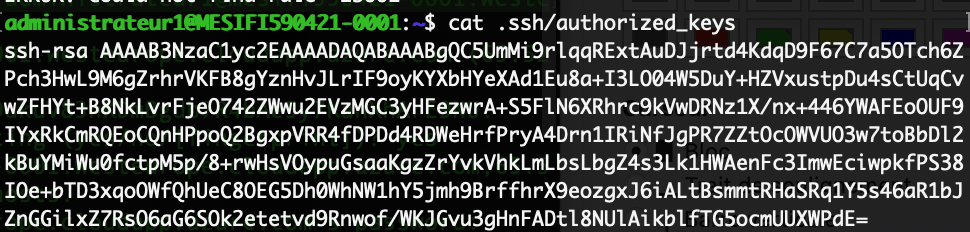
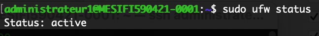
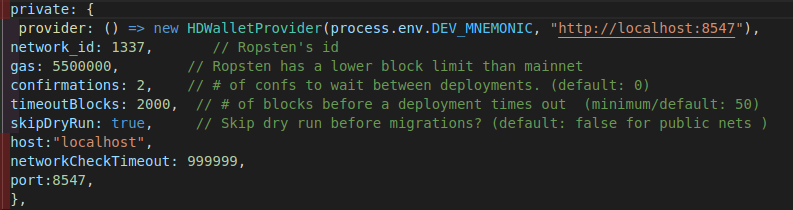
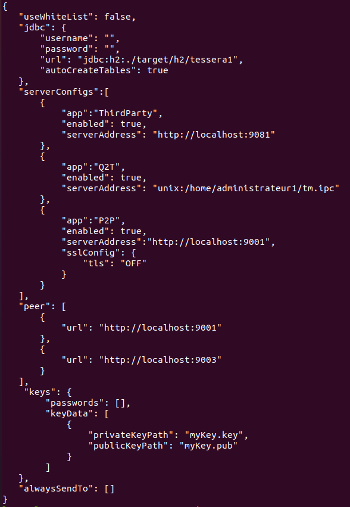

# TD4 Monnaie Numérique

TD4 de monnaie numérique réalisé par Lucas LEVY et Quentin GIBON
 

### SSH setup (2 pts) ✔️
Les clés SSH sont bien configurées :

 

### UFW config (2pts) ✔️
UFW :

 

### Installing dependencies (2pts) ✔️
 

### Installing Quorum (2 pts) ✔️
 
Installed using the github release

### Connect Geth to our group's private network (2 pts) ✔️
 
Followed the teacher's steps 

### Deploy a contract (2 pts) ✔️
On fait un pont SSH pour pouvoir accéder au port de notre noeud RPC et on configure truffle en fonction:

Hash de la transaction du déploiement du contrat : `0x848dbac116a821d7c1aaaf2f0c99dd44bde9c503098c622a426f5199285a889e`
 

### Installing Tessera (2 pts) ✔️
 

### Configure Tessera (3 pts) ✔️
 

We conifgure tessera and check if its up

`curl http://localhost:9081/upcheck` returns `I'm up!`
It's running
### Create a private smart contract with `LXPEzIq3GRMReDaKckedWHkuky52yj45yRou3YA6hkA=` (3 pts)
 
Did not manage