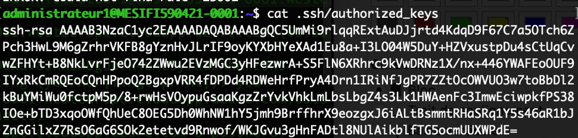
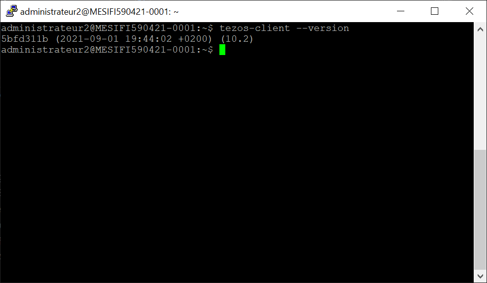

# TD5 Monnaie Numérique

TD4 de monnaie numérique réalisé par Lucas LEVY et Quentin GIBON
 

### Cleaning up setup (1 pts) ✔️
 

### Secure setup with SSH public key (2 pts) ✔️
Les clés SSH sont bien configurées :

 

### Installing dependencies (2pts) ✔️
 

### Install Tezos client (2 pts) ✔️
Bien installé :

 

### Redeem testnet Tez on a faucet (1 pts) ✔️
 

### Run Tezos Client (2 pts) ✔️
 

### Run Tezos baker (2 pts) ✔️
 

### Register an account as a baker (2 pts) ✔️
 

### Register a second account, and delegate baking rights to the first account (2 pts)
 

### Run Tezos endorser (1 pt)
 

### Run Tezos accuser (1 pt)
 

### Turn all 3 softwares into services (2 pts)
 