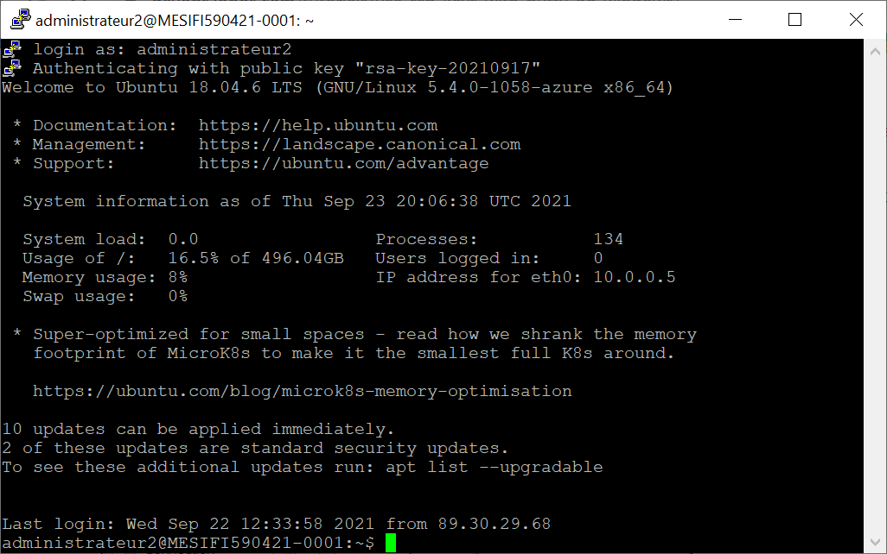
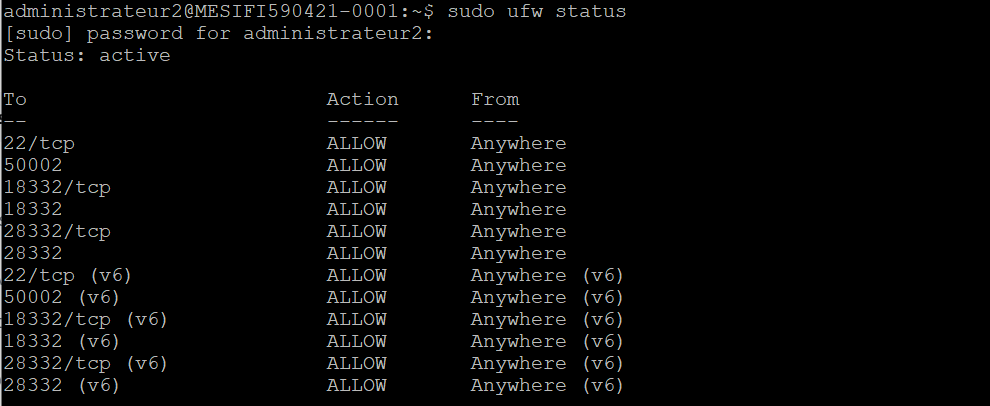
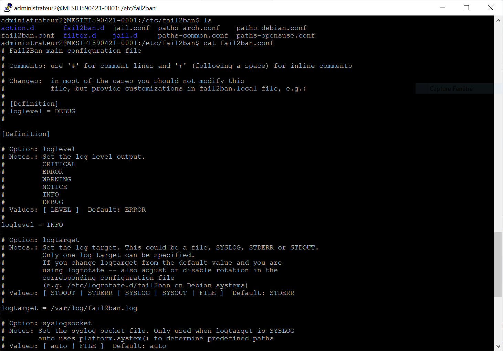
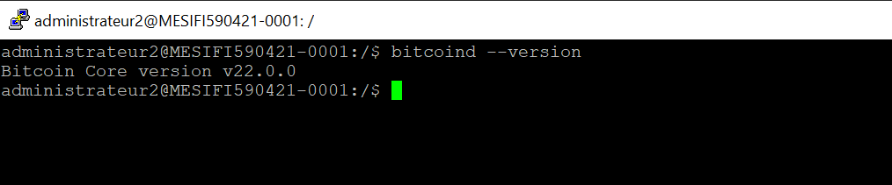
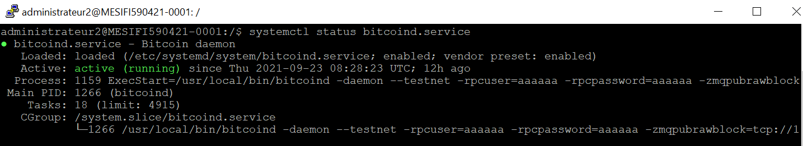
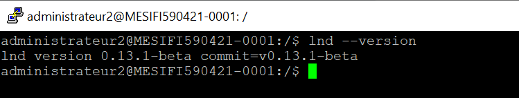
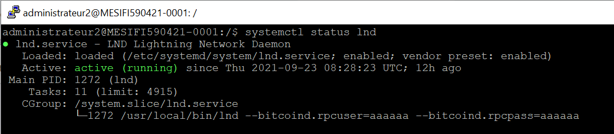
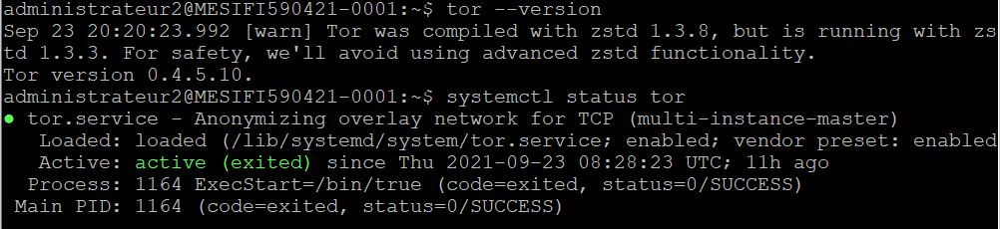

# TD1 Monnaie Numérique

TD1 de monnaie numérique réalisé par Lucas LEVY et Quentin GIBON
 

### Setting up SSH properly (2pts) ✔️
Connection au serveur avec la clé privée :

 

### Setting up UFW and Fail2Ban (2pts) ✔️
UFW :

Fail2ban :

 

### Installing Bitcoind (2pts) ✔️
Bitcoind est bien installé :

 

### Turning BitcoinD into a service (2 pts) ✔️
Bitcoind deamon fonctionne bien :

 

### Creating a wallet and depositing tBTC in it (2 pts) ✔️
 

### Installing LND (2 pts) ✔️
lnd est installé :

 

### Turning LND into a service (2 pts) ✔️
lnd est effectivement actif :

 

### Opening a lightning channel (2 pts) ✔️
 

### Setting up Tor (2pts) ✔️
Tor est configuré :

 

### Running your own BTC explorer (2 pts) ✔️